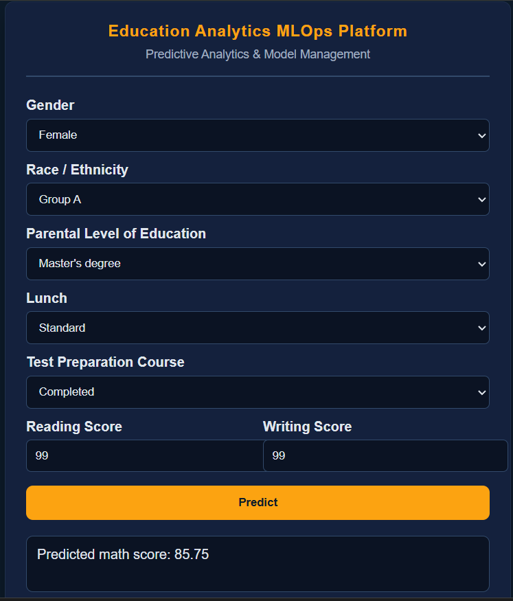

# 🎓 Education Analytics MLOps Platform

>> An **MLOps-based machine learning project** focused on reproducible training,
experiment tracking, and real-time prediction in education analytics.

This project demonstrates **core MLOps practices** including modular pipeline design,
data and artifact versioning, experiment tracking, and containerized inference.
The emphasis is on building a clean, reproducible ML system rather than on
application-level DevOps or cloud infrastructure.


---

```
## 🔁 Project Structure 
```text
education-analytics-mlops/
│
├── app.py
│   └── FastAPI application for serving predictions
│
├── src/
│   ├── components/
│   │   ├── data_ingestion.py
│   │   │   └── Load dataset, train-test split, save raw artifacts
│   │   │
│   │   ├── data_transformation.py
│   │   │   └── Feature engineering, encoding, scaling, preprocessing
│   │   │
│   │   └── model_trainer.py
│   │       └── Train multiple ML models, evaluate, select best model
│   │
│   ├── pipeline/
│   │   ├── train_pipeline.py
│   │   │   └── Orchestrates full training workflow (end-to-end)
│   │   │
│   │   └── predict_pipeline.py
│   │       └── Loads artifacts and performs inference
│   │
│   ├── exception.py
│   │   └── Custom exception handling
│   │
│   ├── logger.py
│   │   └── Centralized structured logging
│   │
│   └── utils.py
│       └── Helper utilities (save/load objects, YAML handling)
│
├── artifacts/
│   └── Versioned outputs (DVC-tracked)
│       ├── raw data
│       ├── transformed data
│       ├── preprocessing objects
│       └── trained models
│
├── mlruns/
│   └── MLflow experiment tracking data
│
├── logs/
│   └── Pipeline execution logs
│
├── Dockerfile
│   └── Docker image for local, reproducible inference environment
│
├── requirements.txt
│   └── Python dependencies
│
├── dvc.yaml
│   └── DVC pipeline definition
│
├── .gitignore
│   └── Ignore artifacts, logs, MLflow runs
│
└── README.md
    └── Project documentation
```

## 🔁 MLOps Workflow Overview
```text
Data
 ↓
Data Ingestion
 ↓
Data Validation & Transformation
 ↓
Model Training & Evaluation
 ↓
MLflow Experiment Tracking
 ↓
Saved Artifacts (DVC)
 ↓
Dockerized Inference Environment
 ↓
FastAPI Prediction Service
```
---

## 🧠 Key MLOps Concepts Implemented

### ✅ Modular ML Pipeline
- Clear separation of concerns
- Independent components for ingestion, transformation, and training
- Easy to extend or replace stages

### ✅ Reproducible Training
- **DVC** for data and artifact versioning
- Same data + same code = same results

### ✅ Experiment Tracking
- **MLflow** logs:
  - metrics
  - hyperparameters
  - trained models
- Easy comparison of multiple algorithms

### ✅ Model Selection
- Multiple regression models trained and evaluated
- Best model selected automatically based on performance

### ✅ Inference Pipeline
- Separate prediction pipeline
- Uses saved preprocessing and trained model artifacts
- Ensures consistency between training and inference

---

## 🧪 Models Used

The following regression models are trained and compared:

- Linear Regression
- Decision Tree Regressor
- Random Forest Regressor
- Gradient Boosting Regressor
- AdaBoost Regressor
- XGBoost Regressor
- CatBoost Regressor

Model performance and parameters are tracked using **MLflow**.

---

## 🚀 Prediction Service

- **FastAPI** is used to serve predictions
- Input is validated and transformed using the same preprocessing pipeline
- Predictions are returned in real time
- Includes a simple browser-based UI

Example input:
```json
{
  "gender": "female",
  "race_ethnicity": "group B",
  "parental_level_of_education": "bachelor's degree",
  "lunch": "standard",
  "test_preparation_course": "none",
  "reading_score": 72,
  "writing_score": 74
}

```

